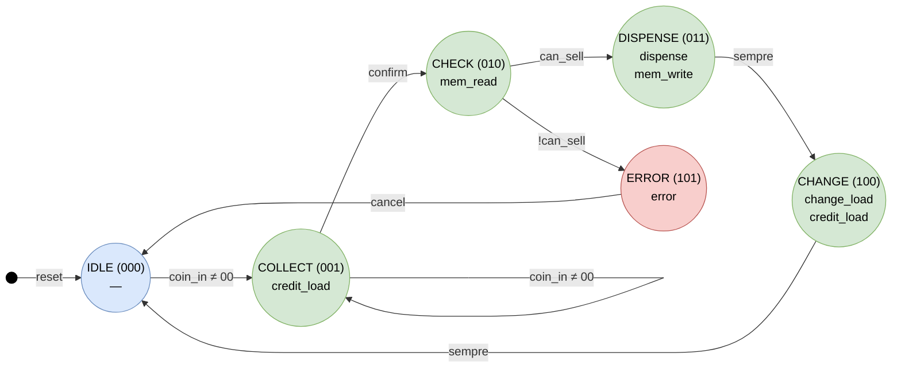

# Diagramas e descrição do controlador de *vending machine*

Documento de referência da arquitetura: os dois diagramas (blocos e estados) e a
**explicação detalhada** de cada bloco, sinal, estado e transição. Serve para
estudar o projeto e para preparar a defesa do relatório.

> **Origem dos números:** todo bit-width, preço, estoque e valor de moeda deste
> documento vem do [enunciado](enunciado.md). Se o enunciado mudar, esta é a
> primeira página a atualizar.

**Como as imagens são mantidas:** cada diagrama aparece primeiro como **SVG**
(exportado do `.drawio`, melhor qualidade visual) e, logo abaixo, como **código
Mermaid** recolhido — a versão editável que versiona bem no git. Ao alterar o
design, atualize os três: o `.drawio`, o `.svg` exportado e o Mermaid.

---

## 1. Visão geral: unidade de controle + caminho de dados

O sistema é um **circuito digital totalmente síncrono** (um único `clk`, um `rst`
síncrono ativo-alto). Ele segue a metodologia clássica de projeto digital, que
separa o hardware em duas partes com papéis bem distintos:

| Parte | Quem é | O que faz | Natureza |
| --- | --- | --- | --- |
| **Unidade de controle** | `control_unit` (FSM de Moore) | **Sequencia** o sistema: decide *quando* cada coisa acontece e emite sinais de controle | Sequencial (registrador de estado) |
| **Caminho de dados** (*datapath*) | `credit_reg`, `memory`, `comparator`, `subtractor` | **Processa** os dados: soma crédito, guarda preços/estoque, compara, subtrai | Registradores + lógica combinacional |

A ideia-chave para explicar ao professor: **a FSM nunca faz conta**. Ela só liga
e desliga sinais de controle (`credit_load`, `mem_read`, `mem_write`, …). Quem faz
aritmética é o datapath. E o datapath **nunca decide** o próximo passo — ele só
entrega resultados (`can_sell`, `change`) para a FSM decidir. Essa divisão de
responsabilidades é o que torna o projeto legível, testável e sintetizável.

---

## 2. Diagrama de blocos

Fluxo de dados entre entradas, *datapath*, unidade de controle e saídas. Setas
cheias = dados; setas tracejadas = clock/reset e **sinais de controle** gerados
pela FSM.

```mermaid
flowchart LR
    subgraph IN[Entradas]
        coin["coin_in&#91;1:0&#93;"]
        sel["sel_item&#91;1:0&#93;"]
        confirm["confirm"]
        cancel["cancel"]
        clk["clk"]
        rst["rst"]
    end

    subgraph DP[Datapath]
        credit["credit_reg<br/>(registrador de crédito, 8b)"]
        mem["memory<br/>(4 × 16: price, stock)"]
        cmp["comparator<br/>can_sell"]
        sub["subtractor<br/>change = credit − price"]
    end

    fsm["control_unit<br/><b>FSM de Moore</b><br/>(6 estados)"]

    subgraph OUT[Saídas]
        o_disp["dispense"]
        o_change["change_out&#91;7:0&#93;"]
        o_err["error"]
        o_display["display&#91;7:0&#93;"]
        o_state["state_out&#91;2:0&#93;"]
    end

    coin -->|coin_value| credit
    sel -->|addr| mem
    confirm --> fsm
    cancel --> fsm
    clk -.-> fsm
    rst -.-> fsm

    credit -->|credit| cmp
    credit -->|credit| sub
    mem -->|price, stock| cmp
    mem -->|price| sub

    cmp -->|can_sell| fsm
    sub -->|change| o_change

    fsm -.->|credit_load| credit
    fsm -.->|mem_read / mem_write| mem
    fsm -.->|change_load| o_change
    fsm --> o_disp
    fsm --> o_err
    fsm --> o_state
    credit -->|display = credit| o_display

    classDef in   fill:#dae8fc,stroke:#6c8ebf,color:#000;
    classDef dp   fill:#d5e8d4,stroke:#82b366,color:#000;
    classDef ctrl fill:#ffe6cc,stroke:#d79b00,color:#000;
    classDef out  fill:#f8cecc,stroke:#b85450,color:#000;
    class coin,sel,confirm,cancel,clk,rst in;
    class credit,mem,cmp,sub dp;
    class fsm ctrl;
    class o_disp,o_change,o_err,o_display,o_state out;
```

<!-- Exporte o diagrama do draw.io como SVG e salve como docs/diagrama-blocos.svg -->


<details>
<summary>Código Mermaid (fonte editável do diagrama de blocos)</summary>



</details>

### 2.1 Sinais da interface (top-level `vending_top`)

**Entradas:**

| Sinal | Largura | Papel |
| --- | --- | --- |
| `coin_in` | 2 b | Moeda inserida neste ciclo: `00`=nenhuma, `01`=R$0,25, `10`=R$0,50, `11`=R$1,00 |
| `sel_item` | 2 b | Item escolhido (0..3). **É também o endereço da memória** — não precisa de decodificador extra |
| `confirm` | 1 b | Pulso síncrono que confirma a compra |
| `cancel` | 1 b | Cancela: devolve o crédito e volta ao IDLE (de qualquer estado) |
| `clk` | 1 b | Clock global |
| `rst` | 1 b | Reset **síncrono**, ativo em nível alto |

**Saídas:**

| Sinal | Largura | Tipo | Papel |
| --- | --- | --- | --- |
| `dispense` | 1 b | Combinacional | **Pulso de exatamente 1 ciclo**: manda liberar o produto |
| `error` | 1 b | Combinacional | Sem estoque ou crédito insuficiente |
| `change_out` | 8 b | Registrada | Troco em centavos (`credit − price`); **carregada por `change_load`** ao entrar em CHANGE |
| `display` | 8 b | Registrada | Crédito acumulado atual (para um display externo) |
| `state_out` | 3 b | Registrada | Estado corrente da FSM — usada para depuração e pelo testbench |

> Como é uma **FSM de Moore**, todas as saídas são função **apenas do estado
> atual**. `dispense` e `error` são decodificados combinacionalmente do estado;
> `change_out`, `display` e `state_out` ficam em registradores. O `change_out`
> tem carga **condicional**: a FSM ativa `change_load` só em CHANGE para capturar
> o troco (por isso ele aparece como seta de controle no diagrama de blocos).

### 2.2 Os blocos do *datapath*, um a um

**`credit_reg` — acumulador de crédito (registrador síncrono de 8 bits)**
Guarda quanto o usuário já inseriu, em **centavos**. 8 bits sem sinal → faixa de
**0 a 255**, suficiente para o item mais caro (100) e para acumular até R$2,55.
É controlado pelo sinal `credit_load` vindo da FSM:
- `credit_load=1` **em COLLECT** → `credit ← credit + coin_value` (acumula a moeda);
- `credit_load=1` **em CHANGE** → `credit ← 0` (zera após entregar o troco);
- `cancel` ou `rst` → `credit ← 0`.

A conversão `coin_in → coin_value` é uma tabela fixa (ponto fixo em centavos):

| `coin_in` | Moeda | `coin_value` (centavos) |
| --- | --- | --- |
| `00` | nenhuma | 0 |
| `01` | R$0,25 | 25 |
| `10` | R$0,50 | 50 |
| `11` | R$1,00 | 100 |

**`memory` — memória síncrona 4×16 bits**
4 posições de 16 bits, endereçadas diretamente por `sel_item`. Cada palavra
concatena preço e estoque: **`price` = 8 bits superiores**, **`stock` = 8 bits
inferiores**. Valores iniciais (carregados num `initial begin`):

| Endereço | Item | `price` (centavos) | `stock` inicial |
| --- | --- | --- | --- |
| `0` | Café | 25 (`0x19`) | 5 |
| `1` | Água | 50 (`0x32`) | 5 |
| `2` | Suco | 75 (`0x4B`) | 3 |
| `3` | Snack | 100 (`0x64`) | 2 |

Comportamento (o "síncrono" é importante):
- **Leitura** (`mem_read=1`): `price` e `stock` aparecem nos fios **no ciclo
  seguinte** — há **1 ciclo de latência**. Modela uma SRAM real.
- **Escrita** (`mem_write=1`): decrementa o estoque do item selecionado
  (`stock ← stock − 1`). **`price` nunca é escrito** — preços são fixos.

**`comparator` — combinacional, produz `can_sell`**
Calcula um único booleano:
```
can_sell = (credit >= price) && (stock > 0)
```
Ou seja: só vende se houver **crédito suficiente E estoque disponível**. É lógica
combinacional pura — **não registra nada e não decide nada**; só entrega o
booleano para a FSM olhar no estado CHECK.

**`subtractor` — combinacional, produz `change`**
```
change = credit - price
```
Calcula o tempo todo, mas o valor só **importa** quando a FSM entra em CHANGE:
aí ela ativa `change_load` para **capturar** `change` no registrador de saída
`change_out`. Ponto sutil e importante para a defesa:
**`change` nunca fica negativo**, porque o comparador já garantiu
`credit >= price` antes de a FSM ir para DISPENSE→CHANGE. Divisão de trabalho: o
comparador garante que a conta é válida; o subtrator só executa. Se o crédito for
exato, `change = 0` e não sai troco.

### 2.3 Sinais internos de controle (glossário)

Estes sinais **não aparecem na interface** — são a "fiação" entre a FSM e o
datapath. Entendê-los é entender o projeto:

| Sinal | Origem → destino | Significado |
| --- | --- | --- |
| `coin_value` | decodificação de `coin_in` → `credit_reg` | Valor em centavos da moeda inserida |
| `credit` | `credit_reg` → `comparator`, `subtractor`, `display` | Crédito acumulado atual |
| `price` | `memory` → `comparator`, `subtractor` | Preço do item selecionado |
| `stock` | `memory` → `comparator` | Estoque do item selecionado |
| `can_sell` | `comparator` → FSM | "Pode vender?" (crédito ok **e** estoque > 0) |
| `change` | `subtractor` → `change_out` | Troco calculado |
| `credit_load` | FSM → `credit_reg` | Ordena somar a moeda (COLLECT) ou zerar (CHANGE) |
| `change_load` | FSM → `change_out` | Ordena capturar (registrar) o troco (CHANGE) |
| `mem_read` | FSM → `memory` | Ordena ler `price`/`stock` (CHECK) |
| `mem_write` | FSM → `memory` | Ordena decrementar o estoque (DISPENSE) |

---

## 3. Diagrama de estados (FSM de Moore)

Estilo de **máquina de estados clássica**: cada estado é um círculo, com as
saídas de Moore escritas **dentro** do estado (dependem só do estado atual) e as
condições de transição **nas setas**. O ponto preto marca o estado inicial
(entrada após `reset`).

<!-- Exporte o diagrama do draw.io como SVG e salve como docs/diagrama-estados.svg -->


<details>
<summary>Código Mermaid (fonte editável do diagrama de estados)</summary>



</details>

> **Reset global:** `cancel` ou `rst` em qualquer estado leva a `IDLE` e zera o
> crédito — por isso não desenhamos uma seta saindo de cada estado.

### 3.1 Os estados, um a um

| Estado | Encoding | Como se **entra** nele | Saídas de Moore ativas | O que acontece |
| --- | --- | --- | --- | --- |
| **IDLE** | `000` | `rst`/`cancel`, ou fim de um ciclo (CHANGE/ERROR→IDLE) | nenhuma | Repouso. Espera a primeira moeda |
| **COLLECT** | `001` | `coin_in ≠ 00` (vindo de IDLE **ou** do próprio COLLECT) | `credit_load` | Acumula: `credit ← credit + coin_value` |
| **CHECK** | `010` | `confirm=1` em COLLECT | `mem_read` | Lê `price`/`stock`; no ciclo seguinte avalia `can_sell` |
| **DISPENSE** | `011` | `can_sell=1` em CHECK | `dispense` (1 ciclo), `mem_write` | Libera o produto e decrementa o estoque |
| **CHANGE** | `100` | sempre, logo após DISPENSE | `change_load`, `credit_load` (=zera) | Registra o troco (`change_out`) e zera o crédito |
| **ERROR** | `101` | `can_sell=0` em CHECK | `error` | Sinaliza falha; espera `cancel` para voltar (devolução do crédito: ⚠️ ver ponto em aberto no Cenário 3) |

### 3.2 As transições, uma a uma

| # | Transição | Condição | Por quê |
| --- | --- | --- | --- |
| 1 | `reset → IDLE` | `rst` | Estado inicial garantido |
| 2 | `IDLE → COLLECT` | `coin_in ≠ 00` | Primeira moeda inicia a coleta |
| 3 | `COLLECT → COLLECT` | `coin_in ≠ 00` | **Self-loop**: cada nova moeda soma ao crédito |
| 4 | `COLLECT → CHECK` | `confirm` | Usuário confirmou a compra |
| 5 | `CHECK → DISPENSE` | `can_sell` | Crédito suficiente **e** há estoque |
| 6 | `CHECK → ERROR` | `!can_sell` | Falta crédito **ou** estoque zerado |
| 7 | `DISPENSE → CHANGE` | sempre | Depois de liberar, sempre calcula troco |
| 8 | `CHANGE → IDLE` | sempre | Troco entregue, crédito zerado, fim do ciclo |
| 9 | `ERROR → IDLE` | `cancel` | Usuário reconhece o erro e recupera o crédito |
| — | `qualquer → IDLE` | `cancel`/`rst` | Reset global: volta ao início e zera o crédito |

### 3.3 Tabela de saídas por estado (decodificação de Moore)

Esta é a "cara" de uma FSM de Moore — a saída é uma função direta do estado.
Útil para conferir o RTL e para explicar ao professor de forma compacta:

| Estado | `credit_load` | `mem_read` | `mem_write` | `dispense` | `error` | `change_load` |
| --- | :-: | :-: | :-: | :-: | :-: | :-: |
| IDLE | 0 | 0 | 0 | 0 | 0 | 0 |
| COLLECT | **1** | 0 | 0 | 0 | 0 | 0 |
| CHECK | 0 | **1** | 0 | 0 | 0 | 0 |
| DISPENSE | 0 | 0 | **1** | **1** | 0 | 0 |
| CHANGE | **1** (zera) | 0 | 0 | 0 | 0 | **1** |
| ERROR | 0 | 0 | 0 | 0 | **1** | 0 |

### 3.4 A sutileza do tempo (leitura síncrona da memória)

Este é o ponto que mais confunde e que provavelmente cai na arguição:

> A memória é **síncrona**: ao ativar `mem_read` no estado CHECK, os valores de
> `price` e `stock` **só ficam válidos no ciclo de clock seguinte**. Portanto o
> `can_sell` do comparador também só é confiável nesse ciclo seguinte. A FSM
> precisa levar essa **latência de 1 ciclo** em conta ao decidir entre DISPENSE e
> ERROR — não se pode olhar `can_sell` no mesmo ciclo em que `mem_read` foi
> ligado, porque os dados ainda não chegaram.

Em resumo: `CHECK` liga o `mem_read` → (1 clock) → `price`/`stock` nos fios →
`comparator` calcula `can_sell` → a FSM ramifica. É por isso que a memória ser
"síncrona" muda o desenho do controle.

---

## 4. Fluxo completo, passo a passo (os 4 cenários de teste)

Os quatro cenários obrigatórios do enunciado, "rodados" como uma sequência de
estados. Reproduzir isto de cabeça é a melhor forma de mostrar domínio na defesa.

### Cenário 1 — Compra bem-sucedida com troco
Entradas: `coin_in=11` (R$1,00), `sel_item=0` (café: preço 25, estoque 5),
`confirm=1`. Esperado: `dispense=1`, `change_out=75`, `credit=0` no fim.

```
IDLE  --coin_in=11-->  COLLECT   credit: 0 → 100
COLLECT --confirm-->   CHECK     lê addr 0: price=25, stock=5
                                 can_sell = (100>=25) && (5>0) = 1
CHECK --can_sell-->    DISPENSE  dispense=1 (pulso); stock: 5 → 4
DISPENSE --sempre-->   CHANGE    change = 100-25 = 75 → change_out=75; credit → 0
CHANGE --sempre-->     IDLE      fim
```

### Cenário 2 — Crédito insuficiente
Entradas: `coin_in=01` (R$0,25), `sel_item=3` (snack: preço 100), `confirm=1`.
Esperado: `error=1`; FSM vai para ERROR.

```
IDLE  --coin_in=01-->  COLLECT   credit: 0 → 25
COLLECT --confirm-->   CHECK     lê addr 3: price=100, stock=2
                                 can_sell = (25>=100) && (2>0) = 0
CHECK --!can_sell-->   ERROR     error=1; aguarda cancel
ERROR --cancel-->      IDLE      crédito devolvido, volta ao início
```

### Cenário 3 — Cancelamento
Entradas: `coin_in=11`, `coin_in=11`, depois `cancel=1`. Esperado: `credit=0`,
FSM volta a IDLE, `change_out=200` (o crédito acumulado é devolvido).

```
IDLE  --coin_in=11-->  COLLECT   credit: 0 → 100
COLLECT --coin_in=11-> COLLECT   credit: 100 → 200   (self-loop)
COLLECT --cancel-->    IDLE      devolve o crédito (change_out=200); credit → 0
```

> ⚠️ **Ponto em aberto (decidir antes do RTL/testbench).** O enunciado espera
> `change_out=200` aqui, mas o `cancel` vai de COLLECT direto para IDLE **sem
> passar por CHANGE** — e `change_out` só é carregado por `change_load`, que só
> ativa em CHANGE. Além disso, o subtrator produz `credit − price`, não o
> reembolso `credit`. O mesmo vale para o estado **ERROR** (o enunciado, na
> seção 6, diz "crédito devolvido via `change_out`"). Ou seja, o enunciado
> sobrecarrega `change_out` com dois sentidos — *troco* (em CHANGE) e *reembolso*
> (em cancel/ERROR) — e o datapath desenhado não produz o segundo. Resolver exige
> uma decisão de projeto (ex.: um mux `credit`/`credit − price` + `change_load`
> também no cancel/ERROR, possivelmente um estado REFUND — o que tensiona o "6
> estados"; ou tratar o reembolso como devolução física, deixando `change_out`
> inalterado). **Confirmar a intenção com o professor.**

### Cenário 4 — Estoque zerado
Comprar café 5 vezes (estoque inicial = 5), depois tentar a 6ª. Esperado: na 6ª,
`error=1` porque `stock=0`.

```
(compras 1..5: cada uma faz stock: 5→4→3→2→1→0, todas com sucesso)
6ª tentativa:
IDLE  --coin_in-->  COLLECT   credit acumula normalmente
COLLECT --confirm-> CHECK     lê addr 0: price=25, stock=0
                              can_sell = (credit>=25) && (0>0) = 0   ← estoque!
CHECK --!can_sell-> ERROR     error=1  (mesmo com crédito de sobra)
```

Repare que o cenário 4 exercita a **segunda** condição do `can_sell` (estoque),
enquanto o cenário 2 exercita a **primeira** (crédito). Juntos, cobrem o `&&`.

---

## 5. Decisões de projeto e justificativas (para o relatório)

O enunciado (item 10.4) pede justificar as decisões. As principais:

1. **FSM de Moore (e não Mealy):** as saídas dependem só do estado, então elas
   são estáveis durante todo o ciclo e não "piscam" com mudanças nas entradas.
   Isso simplifica o timing e a leitura das formas de onda. O enunciado exige
   Moore.
2. **Separar controle e datapath:** a FSM só sequencia (emite sinais de
   controle); o datapath só processa. Cada módulo fica pequeno, testável e
   reutilizável — é a metodologia padrão de projeto digital.
3. **Comparador não decide, só calcula:** `can_sell` é um booleano combinacional.
   Quem transita de estado é a FSM. Isso evita lógica de decisão espalhada.
4. **Subtrator nunca subtrai a mais:** como o comparador garante
   `credit >= price` antes de DISPENSE, o `change` (8 bits sem sinal) nunca
   estoura para negativo. Segurança por construção, não por sorte.
5. **`change_out` registrada (carga condicional):** o troco é capturado por um
   registrador de saída só quando a FSM ativa `change_load` (estado CHANGE), e é
   mantido até a próxima operação. Registrar — em vez de expor o subtrator direto
   na saída — garante um troco estável e válido exatamente no ciclo certo. É por
   isso que aparece uma seta de controle `FSM → change_out` no diagrama de blocos.
6. **Memória síncrona:** modela uma SRAM real e força o tratamento explícito da
   latência de leitura de 1 ciclo (seção 3.4) — mais realista que uma ROM
   combinacional.
7. **`sel_item` = endereço direto da memória:** com 4 itens e 2 bits, a seleção já
   é o endereço; não gasta um decodificador.
8. **Crédito em 8 bits, em centavos:** faixa 0–255 cobre o item mais caro (100) e
   acumulação de várias moedas, evitando ponto flutuante.
9. **Reset síncrono ativo-alto:** exigido pelo enunciado; casa com o fluxo
   totalmente síncrono e evita problemas de reset assíncrono na síntese.

---

## 6. Roteiro de 60 segundos (para começar a defesa)

> "É uma vending machine síncrona controlada por uma **FSM de Moore de 6
> estados**. O usuário insere moedas — cada moeda entra somando no **registrador
> de crédito** de 8 bits enquanto a FSM fica em COLLECT. Ao confirmar, a FSM vai
> a CHECK e lê da **memória síncrona** o preço e o estoque do item selecionado.
> Um **comparador combinacional** produz `can_sell = (credit ≥ price) && (stock >
> 0)`. Se der 1, a FSM vai a DISPENSE, emite o pulso `dispense` e decrementa o
> estoque; depois vai a CHANGE, onde um **subtrator** entrega o troco `credit −
> price` e o crédito é zerado. Se `can_sell` for 0, vai a ERROR e espera
> `cancel`. Um `cancel` ou `rst` em qualquer estado devolve o crédito e volta a
> IDLE. O ponto fino é que a memória é **síncrona**: o preço e o estoque só
> chegam um ciclo depois de `mem_read`, e a FSM decide com base nesse valor."

---

*Estrutura completa dos módulos RTL a implementar: [enunciado.md](enunciado.md)
(seção 11). Ferramentas do fluxo: [tecnologias.md](tecnologias.md).*
